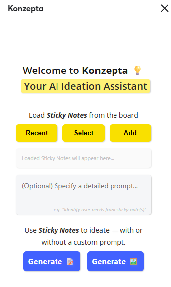

# Konzepta - AI Ideation Assistant

A Miro app integration that helps UX designers and teams generate ideas using AI. The app leverages OpenAI's APIs to generate text suggestions and visual sketches based on sticky notes content.



## Features

- 💡 **Text Idea Generation**: Generate creative ideas and suggestions based on selected sticky notes
- 🎨 **Image Generation**: Create visual sketches and concepts based on text ideas
- 📋 **Board Integration**: Seamlessly adds new ideas to your Miro board
- 🔄 **Smart Selection**: Load all recent sticky notes or select specific ones for focused ideation
- 📝 **Custom Prompts**: Add custom context and prompts for more targeted idea generation
- 📊 **History Tracking**: Keep track of previous generations and prompts (stored locally)

## Use Cases

- UX Research and Ideation Workshops
- Brainstorming Sessions
- Creative Problem-Solving
- Design Thinking Exercises
- Team Collaboration

## Installation

### Prerequisites

- Node.js (v14 or newer)
- Python 3.8+
- Miro Developer Account
- OpenAI API Key

### Setup Instructions

1. **Clone the repository**:
   ```bash
   git clone <repository-url>
   cd konzepta
   ```

2. **Install JavaScript dependencies**:
   ```bash
   npm install
   ```

3. **Install Python dependencies**:
   ```bash
   pip install -r requirements.txt
   ```

4. **Create environment configuration**:
   - Copy `env.example` to `.env`
   - Add your OpenAI API key and Miro API token

5. **Start backend server**:
   ```bash
   python OpenAI_API.py
   ```

6. **Start frontend development server**:
   ```bash
   npm start
   ```

7. **Configure Miro App**:
   - Go to [Miro Developer Platform](https://developers.miro.com/)
   - Create a new app
   - Configure app permissions for reading board content and creating content
   - Set the iframe URL to your development server (default: http://localhost:3000)

## Configuration

### Environment Variables

| Variable | Description |
|----------|-------------|
| `OPENAI_API_KEY` | Your OpenAI API key |
| `MIRO_TOKEN` | Your Miro API token |
| `OPENAI_TEXT_MODEL` | OpenAI model for text generation (default: gpt-4.1) |
| `OPENAI_IMAGE_MODEL` | OpenAI model for image generation (default: gpt-image-1) |

## API Endpoints

The `OpenAI_API.py` file provides several endpoints:

| Endpoint | Description |
|----------|-------------|
| `/` | Root endpoint with API status and available endpoints |
| `/health` | Health check endpoint |
| `/generate-ideas` | Generate text ideas based on sticky note content |
| `/generate-image-ideas` | Generate image ideas from selected shapes with URLs |
| `/generate-text2image-sketches` | Generate image sketches from text content (base64) |

## Usage Instructions

1. Install the app on your Miro board
2. Open the app from the Miro toolbar
3. **Load Content**:
   - Click "Load Recent Stickies" to get the 10 most recent sticky notes
   - Click "Load Selected Sticky" to use currently selected sticky notes
   - Click "Add Selected" to add more sticky notes to your current selection
4. **Generate Ideas**:
   - Optionally add a custom prompt for context
   - Click "Generate Text" to create new idea suggestions
   - Click "Generate Images" to create visual concepts
5. **Add to Board**: Click "Add to Miro Board" to add suggestions to your board

## Technology Stack

- **Frontend**: React.js with Next.js
- **Backend**: Python with Flask
- **AI Services**: OpenAI (GPT-4.1, DALL-E)
- **Integration**: Miro REST API and SDK

## Development

### Folder Structure

```
├── src/                 # Frontend source code
│   ├── app/             # Next.js app directory
│   ├── components/      # React components
│   ├── utils/           # Utility functions
│   ├── assets/          # Static assets and styles
│   └── config.js        # Configuration file
├── OpenAI_API.py        # Backend API server
├── manifest.json        # Miro app manifest
├── requirements.txt     # Python dependencies
└── env.example          # Environment variables template
```

### Available Scripts

- `npm start` - Start development server
- `npm run build` - Build for production
- `npm run lint` - Run ESLint

## Key Components

### GenerateIdeasButton
Main component that handles:
- Loading sticky notes from Miro board
- Managing selected sticky notes
- Generating text ideas with OpenAI
- Generating images from content
- Adding generated content back to Miro board
- Managing prompt history

### MiroAuth
Handles Miro authentication silently in the background.

## Contributing

Contributions are welcome! Please feel free to submit a Pull Request.

1. Fork the repository
2. Create a feature branch 
3. Commit your changes 
4. Push to the branch 
5. Open a Pull Request

## License

This project is licensed under the MIT License - see the LICENSE file for details.

## Acknowledgements

- [Miro Developer Platform](https://developers.miro.com/)
- [OpenAI API](https://openai.com/api/)
- [Next.js](https://nextjs.org/) 
